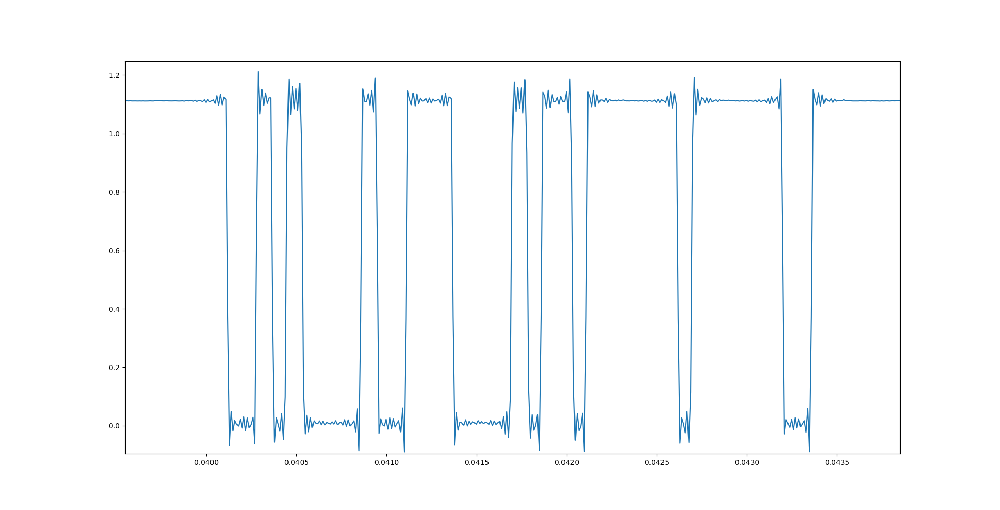
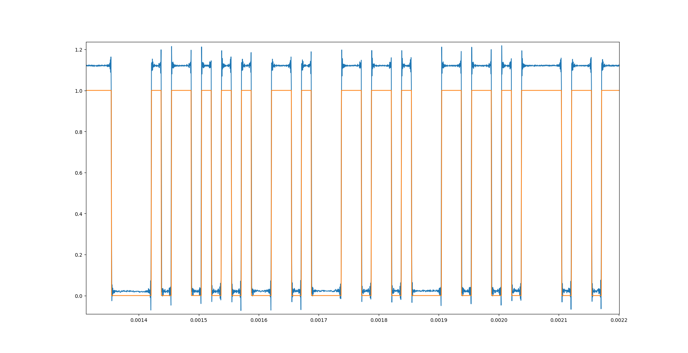

# SDR-Demodulator

Implemented Amplitude Shift Keying(ASK) demodulation using rtl-sdr(software defined radio) to captures rf data samples transmitted by a 434 Mhz module. Data is encoded as UART packets and modulated by 434 Mhz module by ASK. It shows a amplitude vs time plot for recieved data, with a normalised graph.

# Usage

`python3 rf_transmit.py [data] [port]`   
*connect a ftdi module to a 434 Mhz module(tx port <--> data port) and use this script to send data. Check port by `ls /dev/tty*`*   

`python3 sdr_recieve.py`    
*connect a rtl-sdr module with appropriate antenna and run this script* 

# Dependencies

* matplotlib
* pyrtlsdr
* scipy
* numpy
* binascii
* pyserial

# Working


This is a plot of the signal received, we receive signal data from the RTL-SDR in IQ Form. Since data is transmitted using Amplitude Shift Keying, i.e., Bits are encoded as varying amplitudes, So, to extract data we can simply find the absolute value of the signal, that can be done by the following formula:
```
|A| = ((real_part(A))^2 + (img_part(A))^2)^0.5
```

This is done in code as follows
```python
 samples_sq = [sqrt(i.real*i.real+i.imag*i.imag) for i in samples]
```
 
After this step, the signal is decimated by a scale of 50 as follows
```python
samples_sq = decimate(samples_sq,50)
```



Then we superimpose a plot of data after thresholding. Since, data is transmitted as two different discrete amplitude levels, but due to noise that gets added during transmission, the discrete levels rather become a range of amplitude levels, in our case if value of amplitude is below `0.2`, then it represents a `0 bit`, and if the value is above `0.8` it represents a `1 bit`. This process of thresholding is implemented as follows in the code

```python
for i in samples_sq:
        if i<0.2:
            sample_filtered.append(int(0))
        elif i>0.8:
            sample_filtered.append(int(1))
        else:
            sample_filtered.append(int(0))
```

Since, data is encoded as UART packets, after we extract binary data in the above step, we process it to extract the data sent.
In, this case, we had sent `hello` from the RF Module, so it was encoded as utf8 string, which was converted back to data.

This step is done as follows in the code
```python
for i in range(0,len(sample_filtered)-1):
    if sample_filtered[i] > 0.8 and sample_filtered[i+1] < 0.2 and i > i_prev + 325:
            extracted_data_starts.append(i+1)
            i_prev = i

for i in extracted_data_starts:
    extracted_data.append(sample_filtered[i:i+325])
```

After this, data is converted back to ascii and it is printed in the terminal, as well as plotted.
